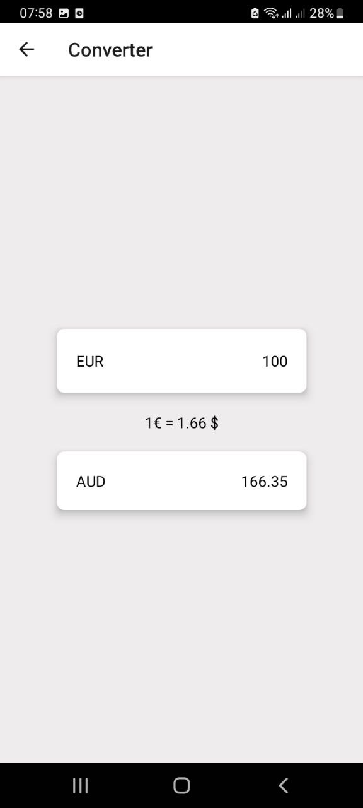
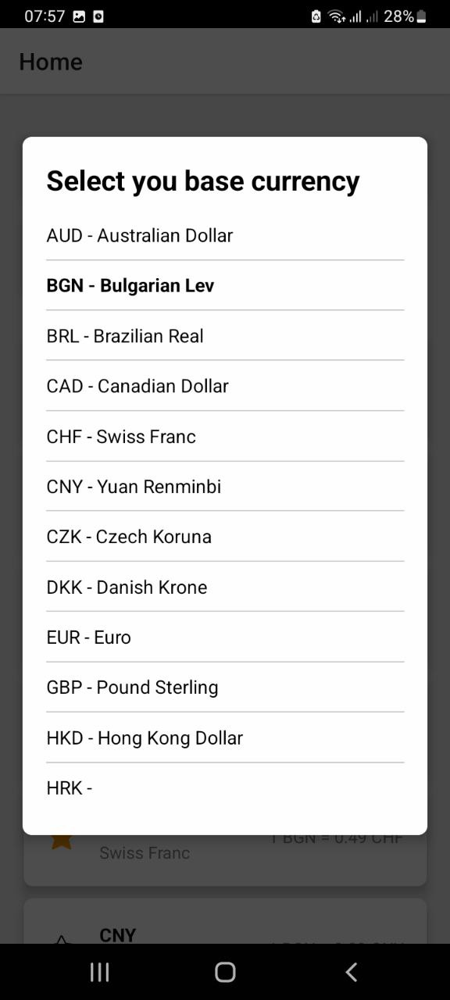

# Currency Exchange Rate

The application is developed using React Native. The application allows you to get a list of currencies rates, add or remove currencies to favorites, change the user's currency, perform a search by currency code, accessible without an internet connection.

## Disclaimer!!!!

The app was tested <u>ONLY</u> on Android platform

<div>
   
    &emsp;&emsp;
   
    &emsp;&emsp;
    
</div>
<br />
<div>
    
    &emsp;&emsp;
    
</div>

## Features

- List of currencies rates.
- Change user currency.
- Add or remove currencies to favorites.
- Filter tasks by type.
- Offline support.

## API

For the API I decided to use [Free Currency Conversion API](https://freecurrencyapi.com/) because they have a free plan with 5000 available requests.

## .env

In the root directory of your project, create a file named `.env`.<br/>
In `.env.example` you can see what you need to add to `.env`

## Installation

### Steps

1. Clone this repository:

   ```bash
   git clone https://github.com/kirill-stepanov/currency-exchange-rate.git
   ```

2. Navigate into the project directory:

   ```bash
   cd currency-exchange-rate
   ```

3. Install the dependencies:

   ```bash
   npm install
   ```

4. Start dev server:

   ```bash
   npm start
   ```

5. Run the app on your android device or emulator:

   ```bash
   npm run android
   ```

## Project Structure

```bash
src/
 ├── assets/         # Static assets such as icons.
 ├── components/     # Reusable components.
 ├── constants/      # Constant values such as routes,async storage keys, etc.
 ├── hooks/          # Custom hooks for various tasks.
 ├── navigation/     # App navigation.
 ├── screens/        # App screens and components related to them.
 ├── store/          # Redux store for state management.
 └── types/          # Types.
```
